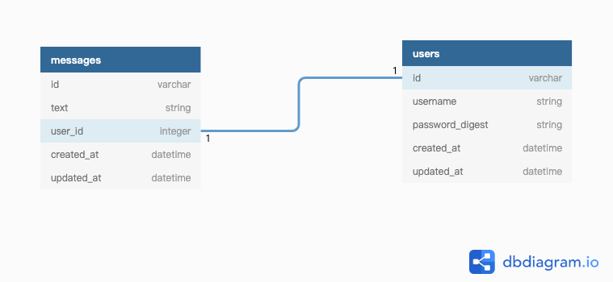

# Chat Out

This is a real-time Rails chat app\
I'm currently a Ruby/Rails app developer, this is my personal project when I was learn from Udemy Course: the-complete-ruby-on-rails-developer-course.

WebSocket\
It can then use this channel to broadcast messages to all users who are ‘subscribed’ to the channel.
Meaning they have the chat window open\
All our users get real-time message updates as soon as they are created\

- 1. Chatroom Channel
  - This handles the server side
  - Messages create action
- 2. JavaScript(browser)
  - Client side
    - JS side where this received
      - chatroom.coffee(coffeescript)

## 1 Development tools

- Ruby 2.6.6

- Rails 5.2.4.1

- SQLite3

- User System

  - Active Model has_secure_password: gem 'bcrypt', '~> 3.1.7'
  - SessionsController, model User

- Layout: gem 'semantic-ui-sass'

- Development test: gem 'rspec-rails'

## 2 Installation

- git clone https://github.com/gorange310/chatout.git rails-folder
- cd chatout
- bundle install
- rails db:migrate
- rails db:migrate
- rails server
- http://localhost:3000/
- Login: username: "Robot1", password: "password"

## 3 table schema

